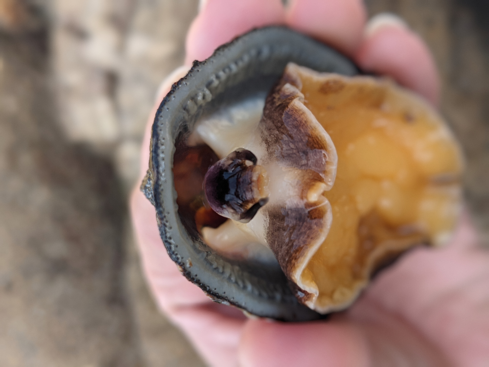
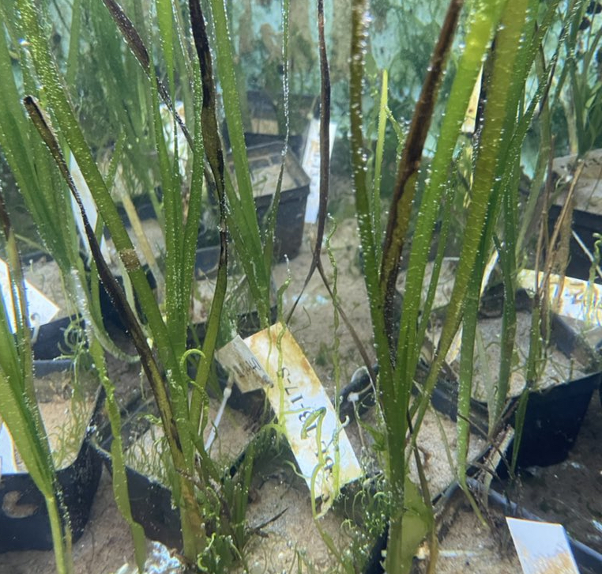

In the Bay Lab, we combine genomic tools with physiological experiments, ecological observations, and large-scale environmental data to learn about how organisms exist in a range of environments and understand how anthropogenic changes in the environment impact individuals, populations, and species. We work in a diverse range of marine systems. Some of the main research themes are summarized below.

---

::: {style="font-size: 0.8em;"}

### Intra-specific variation in coral thermal tolerance
:::: {.columns}
::: {.column width="50%"}
{fig-alt="A photo of a coral reef"}
:::
::: {.column width="5%"}
&nbsp;
:::
::: {.column width="45%"}
Heritable phenotypic variation provides the building blocks for adaptation to future environmental change. In reef-building corals, individuals respond differently to the exact same heat stress event; some bleach and die while other survive. We wonder why this variation exists, how it is maintained, and whether it will fuel future adaptation. Our previous work established differences in fitness-related traits (survival and growth) across a small-scale temperature gradient and identified genetic variation associated with individuals living in hotter environments. We are now combining new sequence technologies, large scale ecological experiments, and sampling across full species distributions to understand the genetic component of thermal tolerance and it may fuel adaptation over space and time.
:::
::::

---

### Eco-evolutionary dynamics of range shifts
:::: {.columns}
::: {.column width="60%"}
Under anthropogenic climate change, the notion that biogeographic boundaries are stable over ecological timescales is no longer tenable. Examples of rapid range shifts associated with climate change now prevail across both terrestrial and marine systems. Such contemporary shifts in species’ distributions may have profound impacts on population dynamics, species interactions, and ecosystem function, and highlight the urgency for understanding and predicting responses to climate change. At the same time, they provide unique opportunities to disentangle fundamental demographic and selective processes that occur during range shifts. We are currently working to understand evolutionary causes and consequences of range shifts. In owl limpets, we have shown that the leading edge of the range expansion harbors high genetic diversity, fueled by gene flow from the range core. At the same time, the trailing range edge supports more population structure and likely more adaptive variation. These studies can further add to our understanding of the evolutionary effects of human-induced range shifts.
:::
::: {.column width="5%"}
&nbsp;
:::
::: {.column width="30%"}
{fig-alt="A photo of a limpet in a hand"}
:::
::::

---

### Adaptation across spatial scales
:::: {.columns}
::: {.column width="35%"}
{fig-alt="photo of eelgrass in pots, some with experimental tags"}
:::
::: {.column width="5%"}
&nbsp;
:::
::: {.column width="55%"}
Many species inhabit a wide range of environments. One mechanism allowing species to persist across such a broad environmental gradients is adaptation to local conditions. In eelgrass (*Zostera marina*) local adaptation can exist over small spatial scales, but whether that response is predictable across larger spatial scales remains unknown. We are combining seascape genomics with ecological experiments to understand the genetic basis of local adaptation in eelgrass and determine the degree to which that is predictable across populations. Our previous work showed that genetic variation is highly structured across two adjacent bays and despite little overlap in genetic variants with strong signals of selection, polygenic scores could be transferred acrosss bayes. This suggests a some degree of parallel genetic response across the two temperature gradients. We are now working expand the geographic scope of this investigation in order to understand the limits to these predictions. 
:::
::::
