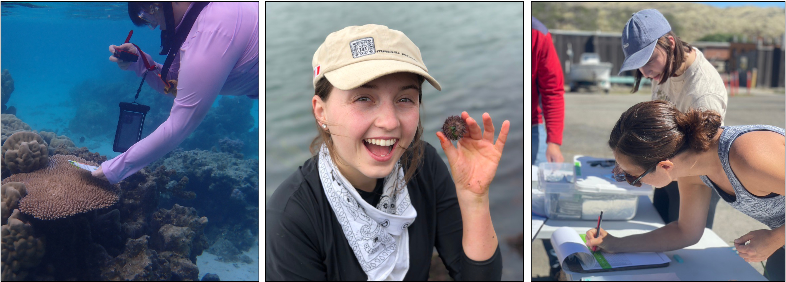

---
# A Demo section created with the Blank widget.
# Any elements can be added in the body: https://wowchemy.com/docs/writing-markdown-latex/
# Add more sections by duplicating this file and customizing to your requirements.

widget: blank # See https://wowchemy.com/docs/page-builder/
headless: true  # This file represents a page section.
weight: 10  # Order that this section will appear.
title: ""
subtitle: ""
hero_media: 
design:
  # Choose how many columns the section has. Valid values: 1 or 2.
  columns: '1'

advanced:
  css_style:
  css_class:
---
**Intro to Ecology and Evolution (BIS2B):** This is a large lecture course for UC Davis undergraduates. It is designed to provide foundational knowledge in ecology and evolution. It is offered in every quarter and Rachael teaches a quarter every other year. 

**Molecular Ecology (EVE 109):** This course provides a survey of molecular methods used to understand ecology, evolution, and conservation in natural populations. It is designed for upper division undergraduates or early career graduate students and is taught every other year. Sections are used to give students experience in hands-on analysis of genetic data using R and students complete an independent project. R tutorials used in section are available [here](https://baylab.github.io/EVE109).

**Principles of Population Biology (PBG 200A):** This is the core course for the Population Biology Graduate Group. Rachael co-teaches this section of the core course in the fall quarter. During this time, she teaches ecological genomics, giving students basic knowledge in genomic technology and analysis in natural systems.

**Marine Genomics:** Postdoc Serena Caplins taught a class on Marine Genomics, which provided basic practice in bioinformatics and genomic analysis in R, with particular focus on methods and theory relevant to marine systems. All the materials for this course are openly available and she has developed both [quarter](https://baylab.github.io/MarineGenomics) and [semester](https://baylab.github.io/MarineGenomicsSemester) length courses. 

&nbsp;

